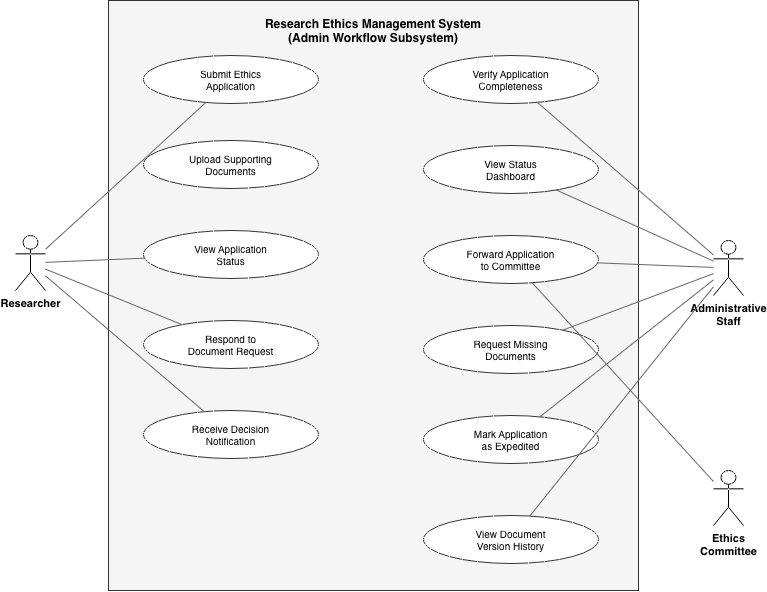

# CITS4401 Software Requirements & Design — Phase 1 Report

**Group Number:** 10

## Group Members

| Name | Student ID | GitHub Username |
|------|-----------|-----------------|
| Fahim Abrar | 24435912 | Fahim-abrar |
| Salman Tariq | 24416486 | salmantarriq |
| Armin Islam | 24771727 | Armin312 |
| Cheng Zhang | 24878502 | kyleczhang |
| Divyanshu Brijesh Singh | 24322871 | Divyanshus123 |
| Kalp Riteshkumar Prajapati | 25073034 | kalp224 |

---

## 1. Stakeholder Identification

### 1.1 Researchers (Honours, Masters, PhD Students, and Academic Staff)

Researchers are the primary users who initiate the ethics approval process. They prepare and submit ethics applications, provide supporting documentation (consent forms, information sheets, risk assessments), and respond to requests for clarification or revision. Their interest in REMS centres on a streamlined, transparent submission process with clear guidance on what is required, real-time visibility into application status, and reduced turnaround times. Researchers currently experience frustration due to delays and a lack of transparency in the existing fragmented process.

### 1.2 Administrative Staff

Administrative staff serve as the operational backbone of the ethics workflow. They receive submitted applications, perform completeness checks against a checklist determined by the application's risk score, and forward verified applications to the Ethics Committee. They act as the communication intermediary between researchers and the Ethics Committee — relaying requests for missing documents and communicating final decisions. Their interest in REMS is a centralised system where all application files are located in one place, with reliable status tracking and version control. From the interview, their single biggest pain point is locating files scattered across email, SharePoint, and the current ERMS platform.

### 1.3 Ethics Committee Members

Ethics Committee members are responsible for reviewing the content of ethics applications and making approval decisions. They assess the methodology, risks to participants, and adequacy of supporting documentation. They may request clarifications directly from researchers on sensitive content matters. Committee members have a hierarchical structure: committee members handle routine reviews, while the Ethics Committee Chair is involved only in high or extreme risk cases. Their interest in REMS is efficient access to application materials, structured review workflows, and the ability to manage conflicts of interest. They also require that their internal deliberations remain confidential from administrative staff and researchers.

### 1.4 Ethics Committee Chair / Ethics Board

The Ethics Committee Chair and the broader Ethics Board oversee policy, handle escalated high-risk cases, and manage structural matters such as conflict-of-interest declarations and reviewer reassignment. They do not participate in routine day-to-day application processing. Their interest in REMS is visibility into policy compliance, the ability to manage escalations, and oversight of committee workload and conflict-of-interest processes.

### 1.5 Research Supervisors

Supervisors inform researchers that ethics approval is required for their projects and may provide guidance on the application. They are an initiating stakeholder — triggering the process — and have an interest in ensuring their students' applications progress smoothly and meet requirements.

### 1.6 Study Participants

Study participants are the individuals whose data and welfare are at the centre of the ethics process. While they do not interact with REMS directly, the system must protect their interests by ensuring that all research involving them has received proper ethical oversight. Their interest is represented through the rigour and integrity of the approval process.

### 1.7 University IT Staff

IT staff are responsible for infrastructure, server maintenance, and data management for the current system. As noted in the interview, they occasionally run analytics on application data to monitor system health and data volumes. Their interest in REMS is a well-architected system that is maintainable, scalable, and provides adequate logging and data management capabilities.

---

## 2. User Stories

The following user stories capture the needs of three key stakeholders: Administrative Staff, Researchers, and Ethics Committee Members.

**US-01.** As an **administrative staff member**, I want all application documents to be stored in a single centralised location so that I do not have to search across email, SharePoint, and the current ERMS to find files.

**US-02.** As an **administrative staff member**, I want to see a real-time status dashboard showing the current stage of every application so that I can track progress without relying on email chains.

**US-03.** As an **administrative staff member**, I want the system to display a checklist of required documents based on the application's risk score so that I can verify completeness quickly and consistently.

**US-04.** As a **researcher**, I want to receive clear guidance on which supporting documents are required for my risk category at the time of submission so that I can provide everything needed upfront and avoid delays.

**US-05.** As a **researcher**, I want to be notified when my application changes status (e.g., received, under review, approved, or returned) so that I have visibility into the process without having to send follow-up emails.

**US-06.** As an **ethics committee member**, I want to view the full contents of application documents within the system so that I can conduct my review without needing to download files from separate platforms.

**US-07.** As an **ethics committee member**, I want to declare a conflict of interest on a specific application and have it escalated to the Ethics Board so that I am recused from the review appropriately.

**US-08.** As an **administrative staff member**, I want the system to maintain a timeline-based version history of all documents submitted for an application so that I can see which version was submitted when, without having to compare email attachments manually.

---

## 3. Interview Report

### 3.1 Venue and Date

- **Date:** 8 April 2026, 12:30 PM — 12:50 PM (approximately 20 minutes)
- **Venue:** Online via Microsoft Teams

### 3.2 Attendance

**Interviewers (Group 10 members):**

- Salman Tariq (24416486) — lead interviewer
- Cheng Zhang (24878502)
- Divyanshu Brijesh Singh (24322871)
- Armin Islam (24771727)
- Kalp Riteshkumar Prajapati (25073034)

**Interviewee:**

- Syed Gilani — acting in the role of **Administrative Staff**

### 3.3 Summary of Responses

#### Q1 & Q2: Application Verification Process and Status Tracking

**Response summary:** The interviewee described the current workflow as follows. A researcher is informed by their supervisor that ethics approval is needed. The researcher completes a risk assessment questionnaire on a separate website, receiving a numerical risk score. They then launch a new case on the current ERMS, enter their risk score, and upload supporting documents. The system determines which documents are required based on the risk score — lower risk means fewer documents, higher risk requires more stringent documentation.

Administrative staff check whether the required documents are present using a quick checklist (taking less than one minute when files are locatable). However, the major pain point is that documents are scattered across the ERMS, email attachments, SharePoint links, and drop links — particularly for sensitive files with unsupported formats (e.g., encrypted, time-sensitive legal documents with metadata-based expiry). Tracking application status relies entirely on email chains. Once an application is passed to the Ethics Committee, admin staff only re-engage when contacted by committee members about issues or when informed of a final decision.

**Key insights:**

- The completeness check itself is fast; the bottleneck is *locating* files across multiple platforms.
- The current ERMS has limited file type support (PDF and Word only), forcing sensitive documents onto other platforms.
- Status tracking is entirely informal, based on email chains with no centralised view.
- Risk score drives document requirements dynamically — the system must support configurable, risk-score-based checklists.

**Refinement to requirements:** The system must centralise all document storage with broad file format support. A status tracking dashboard is essential. Document requirements must be dynamically determined based on the application's risk category.

#### Q3: Supporting Documents and Version Control

**Response summary:** Version control is handled poorly. When a revision is requested, the current process provides poor support for checking whether only the requested changes were made — a legal concern. The only way to track versions is by reviewing email chains to determine which document was sent first. The interviewee expressed a desire for a "thread-based system" with a timeline showing which documents were submitted and when.

**Key insights:**

- Version control is a significant legal and operational concern, not just a convenience issue.
- Unauthorised changes to non-requested sections of documents are a real risk that must be detected.
- The interviewee's mental model is a timeline/thread view of document submissions.

**Refinement to requirements:** The system must maintain a complete, timestamped version history for every document. It should ideally support diff-level tracking or at minimum make it clear which version replaced which, and when. The timeline view should be a core UI element for document management.

#### Q4: Assignment of Applications to Committee Reviewers

**Response summary:** Administrative staff do *not* assign applications to specific Ethics Committee members. After completing the completeness check, they tag the application with its risk score and forward it to the Ethics Committee as a whole. The committee then uses its own rules-based system to determine allocation and prioritisation internally.

**Key insights:**

- This contradicts our initial assumption (from the project brief) that admin staff assign reviewers. In practice, admin staff's role ends at forwarding the verified application.
- The committee operates its own internal allocation process — the REMS should support but not prescribe this.

**Refinement to requirements:** The system should allow admin staff to tag and forward applications to the committee pipeline, but reviewer assignment functionality belongs to the committee's workflow, not the admin interface. The original assumption that admin staff assign reviewers has been corrected.

#### Q5: Communication with Researchers

**Response summary:** Communication is conducted exclusively via email. The only reasons admin staff contact researchers are missing files or inconsistencies. Importantly, admin staff cannot see the *contents* of documents — only headers and file names — so content-related queries are handled directly by Ethics Committee members contacting researchers. This is a privacy constraint: committee deliberations and document contents are privileged.

**Key insights:**

- There is a strict separation of concerns: admin staff handle logistics (missing files), committee members handle content issues.
- Admin staff have no visibility into document contents — only metadata (file names, types).
- Committee-to-researcher communication bypasses admin staff for content-sensitive matters.

**Refinement to requirements:** The system must enforce role-based access control where admin staff can see document metadata but not contents. The communication module must support two distinct channels: admin-to-researcher (for logistical issues) and committee-to-researcher (for content issues), both attached to the application record for audit purposes.

#### Q6: Common Causes of Delays

**Response summary:** Delays occur evenly across both submission and review stages. At submission, researchers may not understand which documents to submit (sometimes due to language barriers). At the review stage, researchers may have submitted all required documents but failed to include the correct content within them — something only the committee can identify. The interviewee noted that the admin team's checklist is only about *presence* of documents, not their quality or content.

**Key insights:**

- Submission-stage delays are caused by missing documents; review-stage delays by inadequate content.
- Admin validation cannot prevent review-stage delays since admin staff cannot read document contents.
- Language barriers are a contributing factor for some researchers.

**Refinement to requirements:** The system should provide clear, multilingual guidance to researchers about document requirements. Automated completeness validation can help with submission-stage delays. Review-stage delays require efficient committee communication tools and reminder mechanisms.

#### Q7: Amendments to Approved Applications

**Response summary:** If a researcher needs to change the scope of their approved research (e.g., extending to a new participant group), the original approval stands only for the documentation originally provided. A completely new case must be launched for the new scope. There is no concept of amending an existing approved application.

**Key insights:**

- This is a significant clarification: amendments are treated as entirely new applications, not modifications of existing ones.
- The original approval remains valid for its original scope — it is not revoked.

**Refinement to requirements:** The system does not need an "amend existing application" workflow. Instead, it should support linking a new application to a prior related case for context. The requirements around amendment workflows can be simplified accordingly.

#### Q8: Confidentiality and Access Control

**Response summary:** The interviewee detailed a layered access model:

- **Admin staff** can see document headers/names and the admin-side audit trail, but cannot see document contents or committee deliberations.
- **Ethics Committee** can see everything: document contents, committee audit trail, and admin audit trail.
- **Researchers** see almost nothing during the process — they are only informed of the final decision (approved or rejected with reasons).

**Key insights:**

- Access control is strict and role-based with clear boundaries.
- The audit trail is split: admin-side actions are visible to both admin and committee, but committee-side deliberations are visible only to the committee.
- Researchers have near-zero visibility into the internal process.

**Refinement to requirements:** The system must implement a role-based access control model with at least three tiers. The audit trail must be segmented: admin actions visible to admin + committee; committee deliberations visible to committee only. Researcher-facing views must be limited to submission status and final decisions with reasons.

#### Q9: Conflict of Interest Management

**Response summary:** Conflict of interest is self-declared. If an Ethics Committee member has a conflict with a researcher, they raise it to the Ethics Board, which manages reassignment. Similarly, if an admin staff member has a conflict, they raise it to the admin board for reassignment. This process is managed independently by the respective boards — admin staff do not play a role in managing committee conflicts.

**Key insights:**

- Conflict management is a self-declaration system, not a proactive check.
- Admin and committee handle their own conflicts through their respective boards.

**Refinement to requirements:** The system should allow any user to declare a conflict of interest on a specific application, triggering a notification to the appropriate board for action. The system does not need to proactively detect conflicts but must provide a clear mechanism for declaration and escalation.

#### Q10: Most Time-Consuming Workflow Areas

**Response summary:** The interviewee reiterated that file management — locating and tracking documents across platforms — is by far the most time-consuming and error-prone part of the workflow.

**Refinement to requirements:** Centralised document storage is confirmed as the highest-priority feature.

#### Q11: Deadlines and Time Limits

**Response summary:** The university promises researchers a two-week turnaround from application submission to decision, assuming no exceptional issues. If an application is stuck in the pipeline and approaching this deadline, it receives an "expedited" tag and is fast-tracked. The researcher is informed of the expedited status if the delay is the university's fault.

**Key insights:**

- A formal two-week SLA exists for the end-to-end process.
- Expedited processing is an existing practice triggered by approaching the deadline.

**Refinement to requirements:** The system must track elapsed time per application from submission and alert admin staff when the two-week deadline is approaching. An "expedited" status flag must be supported, with associated notifications.

#### Q12: Reporting and Analytics

**Response summary:** Admin staff do not currently produce reports and have no obligation to do so. Analytics are handled by IT staff for infrastructure purposes. However, the interviewee noted that reporting would be valuable for predicting seasonal application volumes and planning staffing levels accordingly.

**Key insights:**

- Reporting is not a current requirement but is recognised as valuable.
- The primary use case for reporting would be workload and staffing prediction based on seasonal trends.

**Refinement to requirements:** Reporting should be included as a desirable (not essential) feature. At minimum, the system should retain sufficient data to support future reporting on application volumes, processing times, and outcomes.

---

## 4. Requirements Specification

The following requirements cover the **administrative staff workflow subsystem** of REMS — specifically application intake, completeness verification, status tracking, document management, communication, and deadline monitoring.
The selected subset focuses on application submission and administrative completeness checking. This was chosen because it aligns with the administrative staff stakeholder investigated in the interview and represents a clearly defined and high-impact portion of the REMS workflow, particularly addressing key pain points such as document management, status tracking, and completeness verification.

### 4.1 Functional Requirements

All requirements listed in Section 4.1 are functional requirements, describing system behaviour. Requirements in Section 4.2 are non-functional requirements, describing system constraints and quality attributes.

**FR-01: Centralised Document Storage**
The system shall store all documents associated with an ethics application in a single, centralised repository, accessible from within the application record.

**FR-02: Broad File Format Support**
The system shall accept document uploads in at minimum the following formats: PDF, DOCX, XLSX, common image formats (e.g., JPEG, PNG), and compressed or encrypted files.

**FR-03: Risk-Score-Based Document Checklist**
The system shall display a checklist of required supporting documents for each application, determined automatically by the application's risk score category.

**FR-04: Automated Completeness Validation**
The system shall automatically verify that all documents required by the risk-score-based checklist have been uploaded, and flag any missing items to the administrative staff member reviewing the application.

**FR-05: Application Status Tracking**
The system shall maintain and display the current status of each application. Supported statuses shall include at minimum: Submitted, Under Admin Review, Forwarded to Committee, Returned to Researcher, and Expedited.

Note: Committee decision statuses (Approved, Conditionally Approved, Rejected) are included only as outcome states and are not part of the detailed workflow covered in this subset.

**FR-06: Status Dashboard**
The system shall provide administrative staff with a dashboard view listing all applications and their current statuses, sortable and filterable by status, submission date, risk category, and researcher name.

**FR-07: Document Version History**
The system shall maintain a timestamped version history for each document in an application, recording the upload date, uploader identity, and version sequence. Previous versions shall remain accessible and shall not be overwritten.

**FR-08: Document Timeline View**
The system shall display a chronological timeline for each application showing all document submissions and resubmissions, with timestamps and version identifiers.

**FR-09: Application Forwarding to Committee**
The system shall allow administrative staff to tag a verified application with its risk score and forward it to the Ethics Committee pipeline for review assignment.

**FR-10: Administrative Communication with Researchers**
The system shall allow administrative staff to send requests to researchers regarding missing documents, incomplete submissions, or other administrative issues. Each communication shall be linked to the relevant application record and stored with its sender, recipient, timestamp, and message content.

**FR-11: Committee-to-Researcher Communication**
The system shall provide a messaging mechanism through which Ethics Committee members can send content-related clarification or revision requests directly to researchers. These communications shall be recorded against the application record and shall not be visible to administrative staff where privilege constraints apply.

**FR-12: Deadline Tracking and Alerts**
The system shall track the elapsed time since each application's submission date and generate an alert to administrative staff when an application approaches the two-week processing deadline.

**FR-13: Expedited Status Flag**
The system shall allow administrative staff to mark an application as "Expedited" when the two-week deadline is at risk, with an associated notification sent to the researcher.

**FR-14: Role-Based Access to Documents**
The system shall enforce role-based access controls on application documents. Administrative staff shall be able to view document metadata, including file name, file type, upload date, and version information, but shall not be able to view document contents.

**FR-15: Segmented Audit Trail and Communication Visibility**
The system shall maintain an audit trail for each application, including submissions, status changes, document uploads, forwarding actions, and application-related communications. Administrative actions shall be visible to administrative staff and Ethics Committee members. Committee deliberations and committee-to-researcher communications concerning document content shall be visible only to authorised committee members.

**FR-16: New Case for Scope Changes**
The system shall require that any change in research scope after approval be submitted as a new application. The system shall allow the new application to reference the original approved case.

**FR-17: Conflict of Interest Declaration**
The system shall allow any user (administrative staff or committee member) to declare a conflict of interest on a specific application, triggering a notification to the relevant supervisory board (admin board or ethics board) for reassignment.

### 4.2 Non-Functional Requirements

**NFR-01: Authentication**
The system shall require all users to authenticate before accessing any functionality, using the university's existing identity provider.

**NFR-02: Confidentiality**
The system shall enforce access controls such that application data classified as sensitive (document contents, committee deliberations) is accessible only to authorised roles, as defined in FR-14 and FR-15.

**NFR-03: Audit Integrity**
The audit trail shall be append-only; no user shall be able to modify or delete audit trail entries.

**NFR-04: Availability**
The system shall be available during standard university business hours (8:00 AM — 6:00 PM, Monday to Friday) with at least 99% uptime.

**NFR-05: Response Time**
The system shall load the status dashboard and application detail views within 3 seconds under normal operating conditions.

**NFR-06: Data Retention**
The system shall retain all application records, documents, and audit trail entries for a minimum of 7 years, in compliance with university data retention policies.

**NFR-07: Usability**
The system shall be usable by administrative staff with no more than 2 hours of training, reflecting the straightforward nature of their current checklist-based workflow.

---

## 5. Use Case Modelling

### 5.1 Use Case Diagram

The following use case diagram covers the administrative staff workflow subsystem. It includes two primary actors: **Administrative Staff** and **Researcher**, with the **Ethics Committee** as a secondary actor for interactions at the boundary of the admin subsystem.It aligns with the defined requirements for the administrative workflow subset, particularly requirements related to application submission, completeness verification, status tracking, and communication between stakeholders.

**Actors:**

| Actor | Description |
|-------|-------------|
| Researcher | Submits ethics applications and supporting documents, responds to document requests, and receives decision notifications. |
| Administrative Staff | Verifies application completeness, tracks status, forwards applications to the committee, requests missing documents, manages deadlines, and communicates decisions to researchers. |
| Ethics Committee | Reviews forwarded applications and communicates decisions back through admin staff. Shown as a secondary actor at the subsystem boundary. |

**Use Cases:**

| Use Case | Primary Actor | Description |
|----------|--------------|-------------|
| Submit Ethics Application | Researcher | Researcher creates a new application and enters risk score. |
| Upload Supporting Documents | Researcher | Researcher uploads required documents to the application. |
| View Application Status | Researcher | Researcher checks the current status of their application. |
| Respond to Document Request | Researcher | Researcher uploads additional or revised documents in response to a request. |
| Receive Decision Notification | Researcher | Researcher is notified of the committee's decision. |
| Verify Application Completeness | Administrative Staff | Admin checks uploaded documents against the risk-score-based checklist. |
| View Status Dashboard | Administrative Staff | Admin views all applications with current statuses. |
| Forward Application to Committee | Administrative Staff | Admin tags and forwards a verified application to the committee. |
| Request Missing Documents | Administrative Staff | Admin sends a request to the researcher for missing or incomplete documents. |
| Mark Application as Expedited | Administrative Staff | Admin flags an application approaching the two-week deadline. |
| View Document Version History | Administrative Staff | Admin reviews the timeline of document submissions and revisions. |

### 5.2 Detailed Use Case Description: Verify Application Completeness

This use case focuses specifically on the administrative completeness checking stage of the workflow, which falls within the chosen subset. Committee review and decision-making are outside the scope of this use case.

| Field | Detail |
|-------|--------|
| **Use Case ID** | UC-02 |
| **Use Case Name** | Verify Application Completeness |
| **Primary Actor** | Administrative Staff |
| **Secondary Actors** | Researcher (receives requests for missing documents) |
| **Preconditions** | 1. The administrative staff member is authenticated and logged in. |
| | 2. A researcher has submitted an ethics application with a valid risk score. |
| | 3. The application status is "Submitted." |
| **Postconditions (Success)** | The application status is updated to "Forwarded to Committee" and is visible in the committee pipeline. |
| **Postconditions (Failure)** | The application status is updated to "Returned to Researcher" with a record of missing items, and the researcher has been notified. |
| **Trigger** | Administrative staff member selects an application with status "Submitted" from the dashboard for review. |

#### Main Success Scenario

| Step | Action |
|------|--------|
| 1 | The administrative staff member opens the status dashboard and selects an application with status "Submitted." |
| 2 | The system displays the application details, including the researcher's risk score and a checklist of required documents determined by that risk score. |
| 3 | The system automatically cross-references uploaded documents against the checklist and indicates which items are present and which are missing. |
| 4 | All required documents are present. The administrative staff member confirms completeness. |
| 5 | The administrative staff member selects "Forward to Committee," confirming the risk score tag. |
| 6 | The system updates the application status to "Forwarded to Committee" and records the action (staff member identity, timestamp) in the audit trail. |
| 7 | The system sends a notification to the researcher confirming that their application has passed the completeness check and is now under committee review. |
|